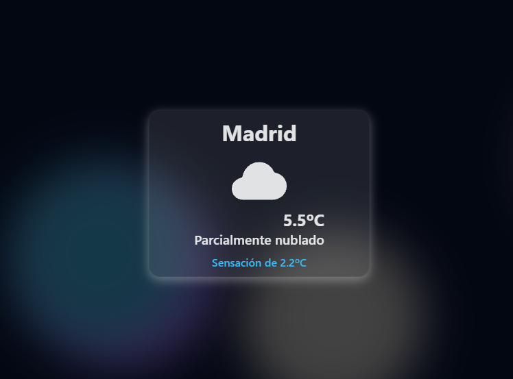

# Weather Card Component

Componente minimalista para consultar el tiempo en tu zona.



## Herramientas


- Utiliza la API de geolocalización del navegador para obtener la ubicación actual del usuario.
- API Open-Meteo para solicitar el tiempo según ubicación.
- API LocationIQ para geocodificación inversa.

## Instalación

```bash
# Crear un archivo .env con la siguiente variable de entorno.
# VITE_RGEO_API_KEY="API_KEY de LocationIQ"

pnpm install

pnpm run dev
```
